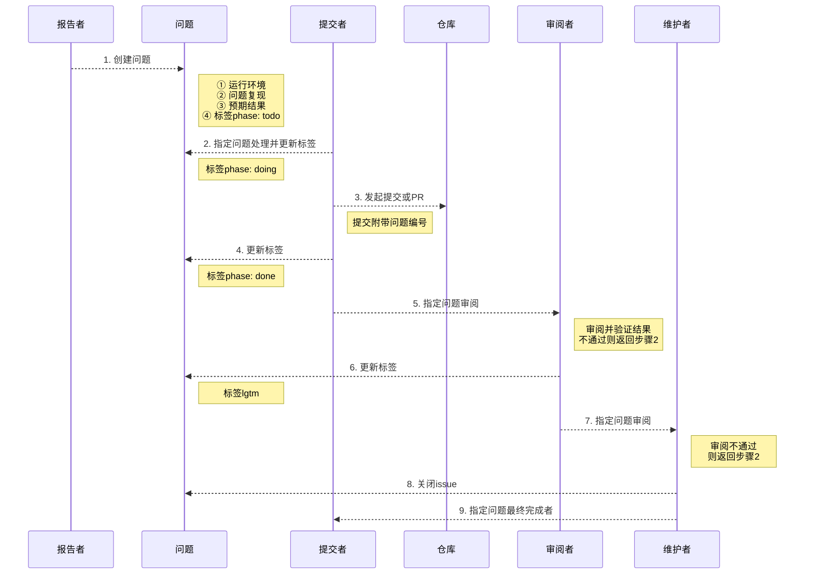

# 参与项目

## 问题处理流程



**备注**

- 问题报告者(reporter)可以是任何成员
- 提交者提交完代码后需要在issue中说明验证的方法
- 审阅者一般选择除提交者外较为熟悉相关代码模块的成员
- 审阅者需要根据提交者提供的验证方法验证结果

## 问题模板

**bug模板**

```
**发生了什么**:
<!-- 此处补充问题产生的结果 -->

**预期的结果**:
<!-- 此处补充正常情况下应该是什么结果 -->

**如何重现**:
<!-- 此处补充复现问题的步骤 -->

**环境**:

- 操作系统: 
- 程序版本:
- 机器配置:
```

**新特性模板**

```
**哪些方面的提升**
<!-- 此处补充该新特性所带来的好处 -->

**原因或需求**
<!-- 此处补充实现该新特性的缘由或现实需求 -->
```

## 提交信息格式

```
{{ 所属模块 }} {{ issue编号 }}: {{ 简单描述 }}

{{ 详细描述 }}

Signed-off-by: {{ 用户名 }} <{{ 用户邮箱 }}>
```
