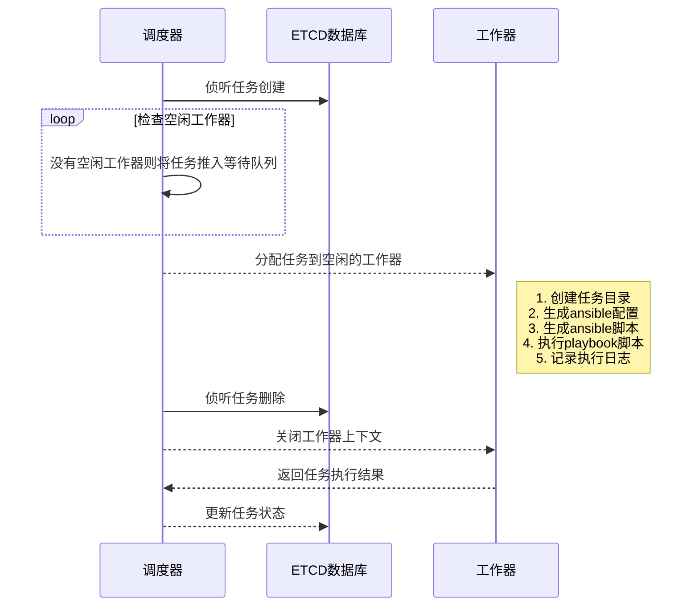

# 任务调度

任务调度顾名思义与任务关联, 完成任务的调度与执行, 主要分为两个部分: 调度器与工作器.

调度器会持续侦听数据库中任务的变更情况. 在任务创建时寻找空闲的工作器, 并将任务分配给工作器执行: 在任务删除时, 发送中断信号给工作器的上下文，指引其终止执行任务.

工作器会根据调度器所分配的任务, 在任务目录下以任务的`.metadata.uid`为目录名称生成一个任务工作目录, 在其中生成如下配置文件:

- ansible.cfg --- ansible配置
- ansible.log --- ansible运行日志
- inventory.X.common.yml --- 全局参数
- inventory.X.inventory.yml --- inventory组及其参数
- playbook.yml --- ansible脚本

根据任务配置生成对应的执行命令，运行脚本并将日志输出到控制台和任务工作目录的`ansible.log中`.

## 工作流程

